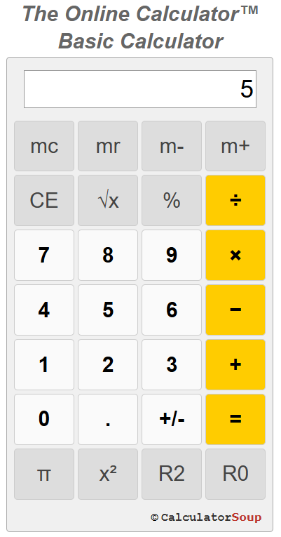

# Calculator 

## 1. Mục tiêu chính
- Kiểm tra tổng hợp kiến thức đã học: Từ biến, hàm, DOM Manipulation, đến sự kiện và xử lý đầu vào.
- Xây dựng ứng dụng thực tế: Một máy tính hoạt động hoàn chỉnh trên trình duyệt, tái hiện logic của các phép tính cơ bản và thao tác người dùng.

## 2. Các phím chức năng mẫu 
> Yêu cầu: Tạo 1 ứng dụng tính toán tương tự như thế này: [Calculator](https://www.theonlinecalculator.com/)  

 

Máy tính này tương tự một máy vi tính cầm tay nhỏ và có 3 chức năng tiêu chuẩn là cộng, trừ, nhân, chia. Nó cũng bao gồm các phím như % (phần trăm), bình phương (square), căn bậc 2 (square root), số pi. 
Phần hiển thị tối đa là 10 chữ số (gồm cả chữ số thập phân) với các phím chức năng sau:

>`mc = Memory Clear`: Xóa bộ nhớ độc lập    
`m+ = Memory Plus`: Thêm giá trị hiển thị vào bộ nhớ độc lập. Ví dụ nhập 20, rồi nhấn m+ thì giá trị của bộ nhớ độc lập tăng thêm 20. Mặc định giá trị ban đầu của bộ nhớ độc lập là 0.  
`m- = Memory Minus`: Trừ số đang hiển thị vào bộ nhớ độc lập. Ví dụ nếu lúc này giá trị lưu trong bộ nhớ độc lập là 20. Giờ ta nhập 15 rồi nhấn phím `m-` thì lúc này giá trị trong bộ nhớ độc lập chỉ còn 5.  
`mr = Memory Recall`: Hiển thị giá trị của bộ nhớ độc lập   
`CE = Clear Entry:` Xóa số vừa mới nhập lên màn hình. Nhấn 1 lần thì sẽ chuyển sang AC    
AC = All Clear: Xóa tất cả các số đang nhập và bắt đầu lại từ đầu. Ví dụ bạn thực hiện phép tính `30 + 20`, sau khi bạn nhập `30 +` thì trên màn hình sẽ trống trơn, sẵn sàn để bạn nhập vào 20. Lúc này bạn lại nhập sai thành 21. Nếu bạn bấm CE thì sẽ xóa 21, lúc này bạn chỉ cần nhập lại 20 rồi nhấn `=` là phép toán được thực hiện. Tức là CE sẽ không xóa `30+` đã nhập trước đó. Nhưng nếu bạn nhấp AC thì toàn bộ sẽ bị xóa. PHải nhập lại từ đầu.  
`√x = Square Root`: Ví dụ bạn nhập 9 rồi nhấn phím này thì màn hình sẽ trả kết quả là 3    
`+/-` = Plus/Minus: Đổi dấu của giá trị đang hiển thị giữa âm/dương và ngược lại.  
`π = pi:` hiển thị giá trị 3.141592654 để dùng trong tính toán  
`x² = Square`: Ví dụ nhập 3 rồi nhấn phím này thì sẽ hiển thị kết quả là 9   
`R2 = Round to 2 decimals`: Làm tròn số đang hiển thị còn 2 số thập phân   
`Back` Trong ứng dụng mẫu là phím `R0`, nhưng ở đây đổi thành phím `Back`, cho phép xóa từng ký tự 1. Ví dụ trên khi bạn nhập sai là 21, thay vì nhấn `CE` để xóa cả 21, bạn nhấn `Back` để xóa 1, rồi nhập 0 là xong.    
`% = Percent`: Sử dụng giá trị hiển thị để tính phần trăm. Ví dụ nhập `20` `x` `25` `%` thì sẽ chính là 5. Tức là nếu nhập 25 rồi nhập % thì sẽ là 25/100 = 0.25. Khi đó 20 x 0.25 = 5.  

### Tính toán phần trăm %
Với phép nhân và chia: Chuyển % thành số thập phân rồi thực hiện tính toán.
  
>Tính 20% của 25  
>Nhập: `25 × 20 %`  
>Máy tự chuyển 20% thành 0.2  
>Sau đó thực hiện: 25 × 0.2 = 5  
>Kết quả hiển thị là 5

Với phép cộng và trừ: Máy tính tính phần trăm của số ban đầu, rồi cộng/trừ với số đó. Ví dụ:  
> Cộng 20% vào 25  
Nhập: `25 + 20 %`  
Máy tính: 20% của 25 là 5, sau đó: 25 + 5 = 30  
Kết quả hiển thị là 30  

>Trừ 20% khỏi 25  
Nhập: `25 - 20 %  `  
Máy tính: 25 - 5 = 20  
Kết quả hiển thị là 20  

>Tính thuế  
Ví dụ: Thêm 6% thuế vào hóa đơn trị giá 851  
Nhập: 851 + 6 %  
Máy tính: 6% của 851 là 51.06  
Sau đó: 851 + 51.06 = 902.06  
Kết quả hiển thị là 902.06  

## 3. Yêu cầu và gợi ý xây dựng
- Viết các hàm toàn học cơ bản : `add`, `substract`, `multiply`, `divide` 
- Giao diện HTML cơ bản với các nút như trên
- Tạo hàm operate(). Khi người dùng nhấn nút `=` thì gọi hàm này.
- Đưa ra cảnh báo khi chia cho `0`.
- Tạo cả nút `Back` cho phép xóa từng chữ số trên màn hình. Thay phím `R0` trong ứng dụng Calculator phía trên bằng phím `Back`.
- Hỗ trợ cả bàn phím, cho phép người dùng nhập liệu không cần chuột.
- Nhận diện các thao tác thừa như nhấn nhiều lần 1 toán tử, nhấn nhiều lần dấu `.` của phần thập phân, và tự bỏ qua thao tác thừa.
- Làm tròn số phần thập phân dài để không tràn giao diện.
- Chỉ xử lý từng cặp số 1 lần, không cho phép nhập nhiều phép toán liên tục (nếu nhập liên tiếp kiểu như 2 x 4 + 7^2 thì lại rất dễ)

## 4. Cảnh báo
- Không dừng hàm `eval()` hoặc `new Function()` vì rủi ro bảo mật, thay vào đó cần từ xây dựng hàm xử lý biểu thức toán học để tăng kỹ năng lập trình logic và kiểm soát dữ liệu đầu vào. 

