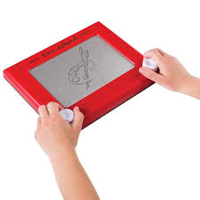

Một Etch-A-Sketch là 1 thiết bị vẽ cơ học, có thể xóa được:  
>

Đây Là một thiết bị có màn hình kính và hai núm điều khiển. Khi xoay các núm, người chơi có thể vẽ các đường thẳng trên màn hình.
>- Núm bên trái: điều khiển lên/xuống.
>- Núm bên phải: điều khiển trái/phải.  

Để xóa hình vẽ, người chơi chỉ cần lắc nhẹ thiết bị, và màn hình sẽ trở lại trạng thái trắng.

# Đây là một dự án thực hành rất hay để bạn luyện tập JavaScript, DOM, và Flexbox.
# Dưới đây là yêu cầu từng bước của dự án

## 1. Tạo trang web với lưới 16x16 ô vuông
Mục tiêu: Hiển thị 256 ô vuông (16 hàng × 16 cột).  
Mỗi ô là một div có kích thước bằng nhau.  
Không được viết tay từng div trong HTML – phải tạo bằng JavaScript.
Tạo một div container trong HTML để chứa toàn bộ các ô.  
Dùng JavaScript để tạo vòng lặp, sinh ra 256 div con và thêm vào container.

## 2. Sử dụng Flexbox để bố trí lưới
Mặc dù tên là “grid”, bạn không được dùng CSS Grid.  
Dùng Flexbox để sắp xếp các div thành dạng lưới.  
Tính toán kích thước mỗi ô sao cho vừa khít trong container (ví dụ: nếu container rộng 960px thì mỗi ô sẽ khoảng 60px).

## 3. Cẩn thận với border và margin
Border và margin có thể làm các ô bị lệch kích thước, không đều nhau.  
Tránh dùng margin nếu không cần thiết, hoặc tính toán kỹ.

## 4. Debug nếu lưới không hiển thị
Kiểm tra các lỗi phổ biến:  
- Đã liên kết đúng file CSS chưa?  
- Có lỗi JavaScript trong console không?  
- Các div có được tạo ra nhưng bị ẩn không?  
- Dùng console.log để kiểm tra quá trình tạo div.  

## 5. Thêm hiệu ứng “hover” để đổi màu
Khi chuột đi qua một ô, ô đó đổi màu như đang vẽ.  
Thay đổi style.backgroundColor bằng JavaScript.  

## 6. Thêm nút để tạo lưới mới
Nút nằm ở đầu trang.  
Khi nhấn, hiện hộp thoại yêu cầu nhập số ô mỗi cạnh (ví dụ: 64).  
Xóa lưới cũ, tạo lưới mới với kích thước vừa nhập.  
Tổng kích thước container vẫn giữ nguyên (ví dụ: 960px).  

## 7. Đẩy dự án lên GitHub
Tạo repo và commit toàn bộ mã nguồn.    
Đây là bước quan trọng để lưu trữ và chia sẻ dự án.  

# 🌟 Extra Credit (Thử thách nâng cao)
## 8. Tạo màu ngẫu nhiên cho mỗi ô khi hover  
Mỗi lần chuột đi qua, ô đổi sang màu RGB ngẫu nhiên.  

## 9. Hiệu ứng làm tối dần
Mỗi lần hover, ô tối hơn 10%.  
Sau 10 lần thì ô sẽ hoàn toàn đen.  
Dùng thuộc tính opacity trong CSS.  
Tăng dần opacity mỗi lần hover (ví dụ: từ 0.1 → 0.2 → ... → 1).
Tức là mỗi 1 ô mặc dù lần đầu sẽ là 1 màu ngẫu nhiên, nhưng từ lần sau hover qua
thì vẫn phải là mầu đó, chỉ có là tối hơn 