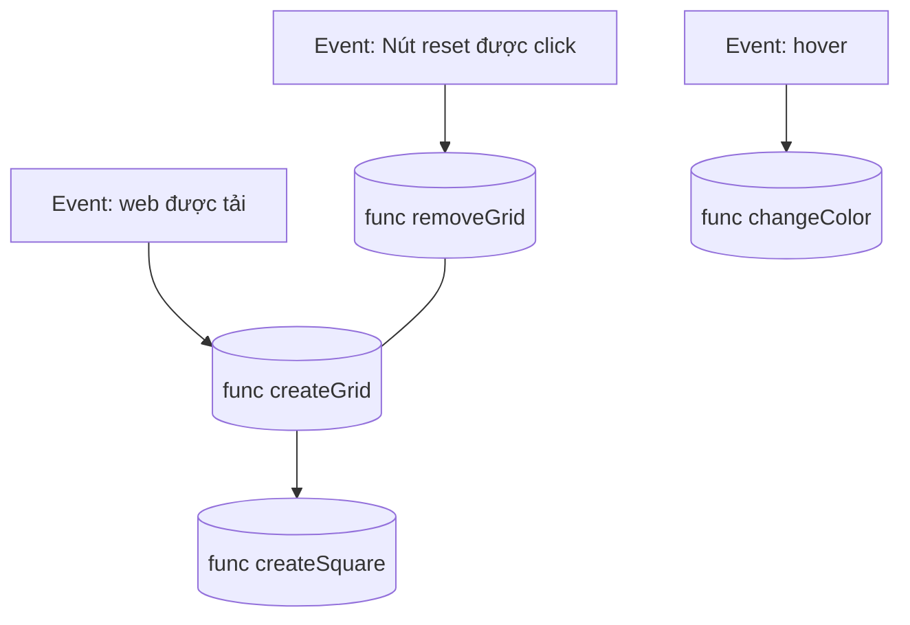

- Tạo file index.html 
- Trên đầu của page, tạo 1 button, đặt tên là Reset
- Trong file tạo 1 div, với class là container, kích thước là 960x960px 
- Tạo file etchASketch.js để viết logic cho app
- Liên kết file .js với file .html
- Mở file index.html trong trình duyệt, 
- Mở luôn Tab console của DevTools.

- **Trong file .js**
    **Khai báo hàm**:
    - Viết hàm tạo 1 div square là createSquare.
    - Viết 1 hàm tạo 1 lưới là createGrid(n), với n là 1 số nguyên <=100.
    - Trong hàm creatGrid sẽ có 2 vòng lặp for lồng nhau, mỗi lần lặp sẽ gọi hàm createSquare 1 lần.
    - Viết 1 hàm gọi là removeGrid, hàm này sẽ xóa toàn bộ các div squares hiện tại.

    **Gọi hàm**: 
    - Sử dụng trình lắng nghe sự kiện khi page được load, sẽ gọi createGrid(16).
    - Sử dụng 1 trình lắng nghe sự kiện cho nút Reset, khi nút này được bấm thì hiển thị prompt cho người dùng nhập số n. Sau đó sẽ gọi hàm removeGrid(), sau đó gọi hàm createGrid(n). Tạo ra lưới mới với kích thước vẫn là 960x960px.

- **Xử lý sự kiện đổi màu khi hover**:
    - Viết 1 hàm đổi màu ngẫu nhiên khi di chuột qua div square, gọi là changeColor.
    - Có 1 biến đếm là i, với mỗi lần 1 square div được hover qua thì opacity = 0.1*i. Sau 10 lần thì i sẽ = 1 là tối đa. (màu sẽ hoàn toàn tối đen)

 
